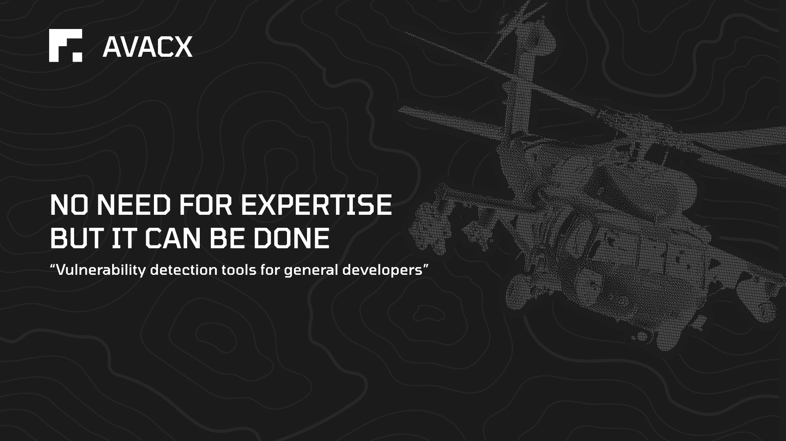

<p align="center">
  <a href="#" target="_blank" rel="noopener">
    
  </a>
</p>

## Vulnerability Detection Tools for General Developers
>It is easy to use and simple, making it ideal for developers without cybersecurity knowledge, as well as small to medium-sized businesses that need basic security audits.

<p align="center">
  <a href="#" target="_blank" rel="noopener">
    
  </a>
</p>


## AVACX Tools Package includes:
**Reverse engineering** 
- **Snip** - Find and check for vulnerabilities in your code or project.

**Offensive**
- **Vulture** - Find your SQL security vulnerabilities.

## Get Started
1. Clone the repository:
```
git clone https://github.com/ffoster007/AVACX.git
cd AVACX
```
## Linux/MacOS:
```
cp webapp/.env.example webapp/.env
bash start.sh
```
## Windows:
```
copy webapp\.env.example webapp\.env
.\start.ps1
```


## Project Maps

List of repositories and their descriptions:

| Structure                                        | Description                                                                                                           |
| :-------------------------------------------- | :-------------------------------------------------------------------------------------------------------------------- |
| [avacx](/avacx/README.md) | All systems avacx tools                                                                                            |